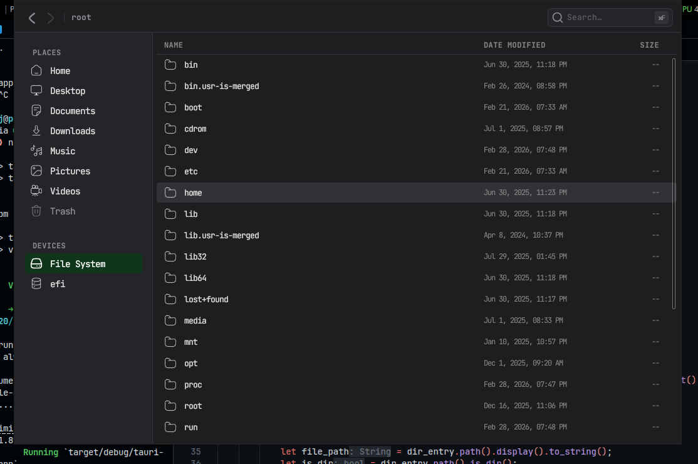

# Perch File Explorer


Trying to make my own file explorer for fun.


---



---

### What works right now

- Can read and navigate the file system.
- Detects mounted drives and standard user directories (Linux).
- Double-click to open any file using the system's default application.
- Displays files in a list view, showing metadata like file size and date modified.
- Icons for different file types (images, code, video, audio, etc.) and folders.
- Can use the breadcrumbs and undo-redo on navbar to navigate.

## The technologies

- Tauri Framework:
  - React, TypeScript, and vanilla CSS for the UI.
  - Rust for file system interactions and OS-level operations.

## Getting Started

To run this project locally, you will need to have [Node.js](https://nodejs.org/), [Rust](https://www.rust-lang.org/tools/install), and the Tauri prerequisites installed on your machine.

### Installation

```bash
    # clone
    git clone <repository-url-here>.git

    # cd into the repository
    cd <repository-name-here>

    # install frontend dependencies
    npm install

    # run the development server
    npm run tauri dev
```
